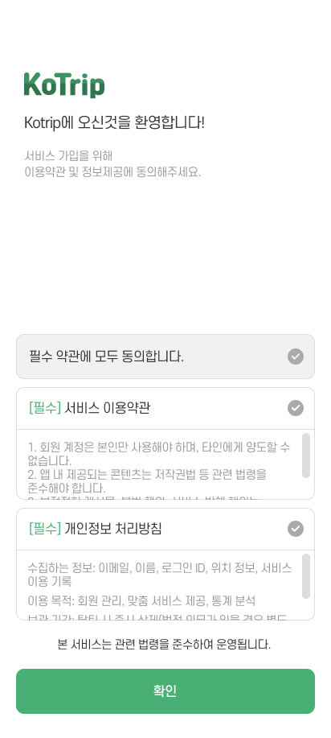
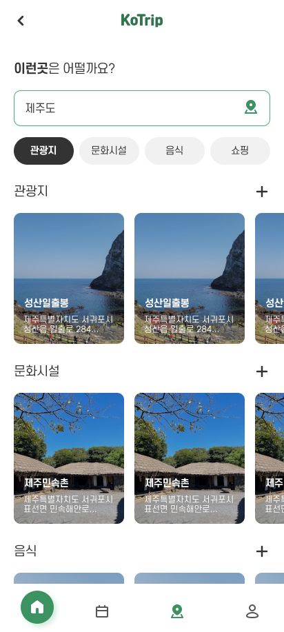
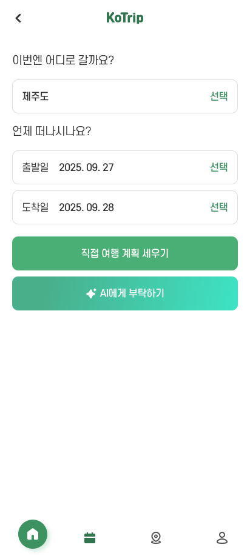
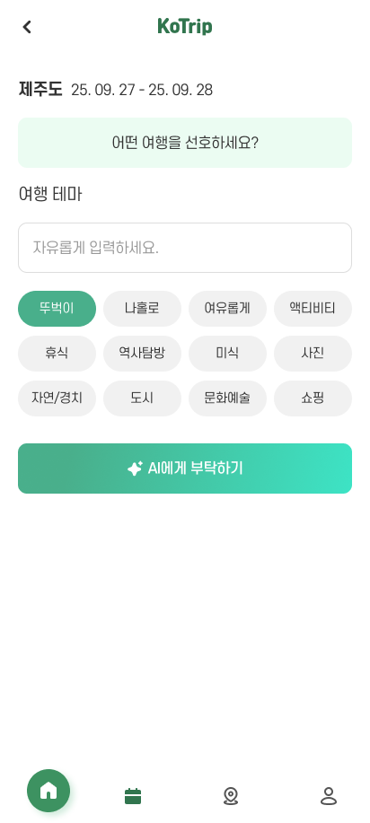
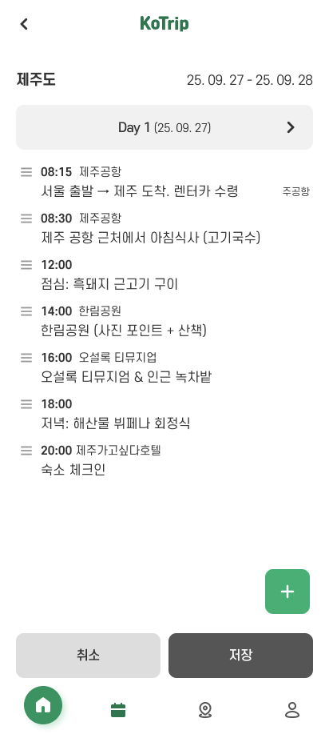
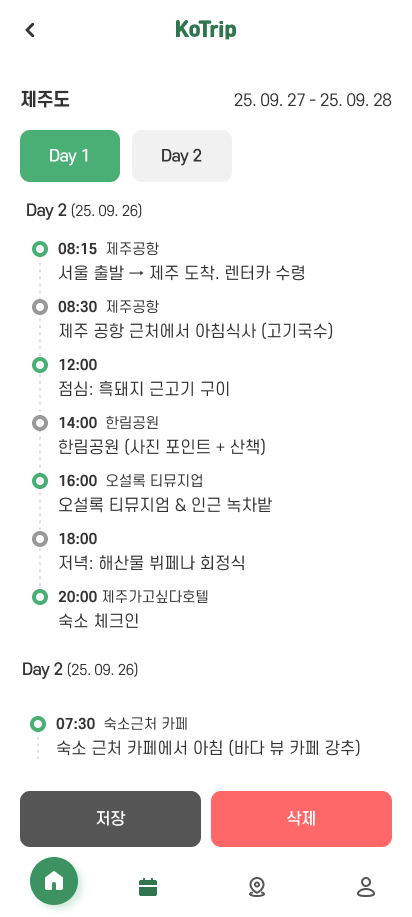
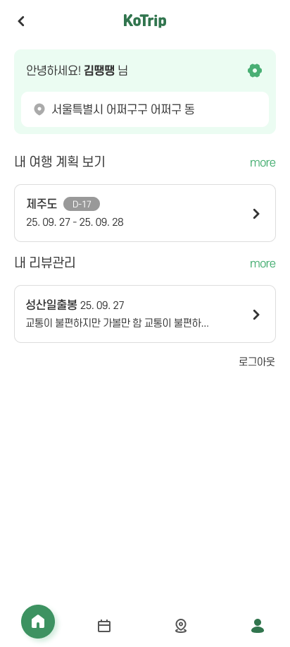
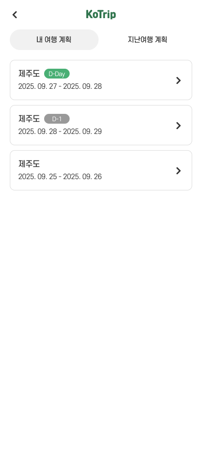

# Kotrip
여행 일정 추천부터 계획, 관리까지 한 곳에서 가능한 Flutter 앱입니다.
---
## 주요 기능
* Firebase 인증 (Google, Apple)
* Firestore 데이터베이스 연동
* 현재 위치 기반 주소 검색

## 사용 기술
| 카테고리       | 사용 기술                                   |
| ---------- | ---------------------------------------- |
| 상태 관리      | Riverpod                                 |
| 네트워킹       | Dio                                      |
| Firebase   | Core, Auth, Firestore                    |
| 로그인        | Google Sign-In, Apple Sign-In            |
| UI & 애니메이션 | Carousel Slider, Lottie, Cupertino Icons |
| 위치 정보      | Geolocator                               |
| 환경 변수      | Flutter Dotenv                           |
| 기타         | URL Launcher, Intl                       |

---

## 환경 변수 설정
앱 실행 전, 프로젝트 루트에 .env 파일을 생성하고 필요한 변수를 추가하세요.

---
## 스크린샷
### 스플래시, 홈화면

  
  
  

### 여행지 추천 화면

  
  

### 여행 계획 화면

  
  
  
  

### 마이페이지

  
  

